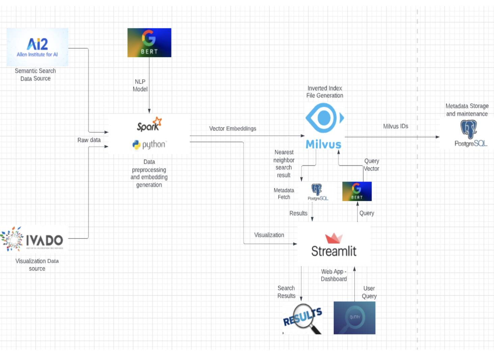

# Coronavirus-Observatory-VIsualization-Dashboard
Covid Semantic Search Engine and Data Analytics

## Architecture Diagram


# Semantic Search System
## Setting up the Backend of the Search System

### 1. Start Milvus Server
Download and install Milvus Standalone using docker compose. Refer: https://milvus.io/docs/install_standalone-docker.md or follow the instructions below.

```
$ wget https://raw.githubusercontent.com/milvus-io/milvus/master/deployments/docker/standalone/docker-compose.yml -O docker-compose.yml
$ sudo docker-compose up -d
```

**docker ps -a** should show the following:
```
      Name                     Command                  State                            Ports
--------------------------------------------------------------------------------------------------------------------
milvus-etcd         etcd -advertise-client-url ...   Up             2379/tcp, 2380/tcp
milvus-minio        /usr/bin/docker-entrypoint ...   Up (healthy)   9000/tcp
milvus-standalone   /tini -- milvus run standalone   Up             0.0.0.0:19530->19530/tcp, 0.0.0.0:9091->9091/tcp

```
### 2. Start Postgres Server

```
$ docker run --name postgres0 -d  -p 5438:5432 -e POSTGRES_HOST_AUTH_METHOD=trust postgres
```
**docker ps -a** should show that it is up and running

### 3. Dumping data into Milvus and Postgres
We will use Milvus to store vectors and Postgres to store metadata corresponding to these vectors. The milvus id corresponding to the milvus vector will act as the primary key for both these tables. Postgres stores metadata such as the title of the article, abstract, authors, and the url. 

Before doing so, install the source code using the lines below at the root of this repo.  

```
$ python -m pip install .
```

Now run the following to build the backend of the search system

```
$ python cli/build.py --data_path "/abs/path/to/data.csv"
``` 
Specify the absolute path to the dataset using --data_path and the model name using --model_name. The model name is an optional argument and will use "multi-qa-MiniLM-L6-cos-v1" unless otherwise specified. 

This step will take 1 hour per million rows which includes embedding generation time as well as insertion into Milvus and Postgres.

You should see a message "Pushed Data to Milvus and Postgres" at the end of this step.

## Inference
The inference code has been wrapped as an API and can be called either via command line interface or using the streamlit app.

### For command line, use: 

```
$ python cli/inference.py --query "effect of face coverings for covid"
```

Specify the query using --query argument and the number of results using --no_of_results which is an optional argument with a default value of 10.

### For streamlit, use: 

```
$ streamlit run api/main.py
```

